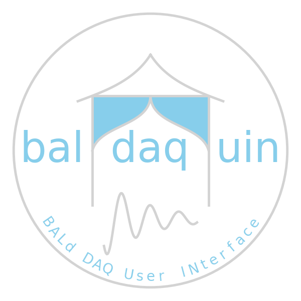
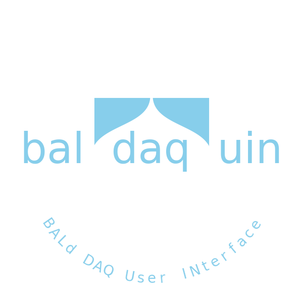

.. baldaquin documentation master file, created by
   sphinx-quickstart on Sun Jul  3 11:54:55 2022.
   You can adapt this file completely to your liking, but it should at least
   contain the root `toctree` directive.

==================================
baldaquin: BALd DAQ User INterface
==================================

baldaquin (or the BALd DAQ User INterface) is an attempt at a general-purpose,
modular and reusable data acquisition framework based on modern technologies.
(And, before you get *too* excited, baldaquin is just a stub, and chances are
that it might never actually turn into something useful.)

By the way: :ref:`why baldaquin? <about>`

.. toctree::
   :maxdepth: 2

   about
   install

   api
