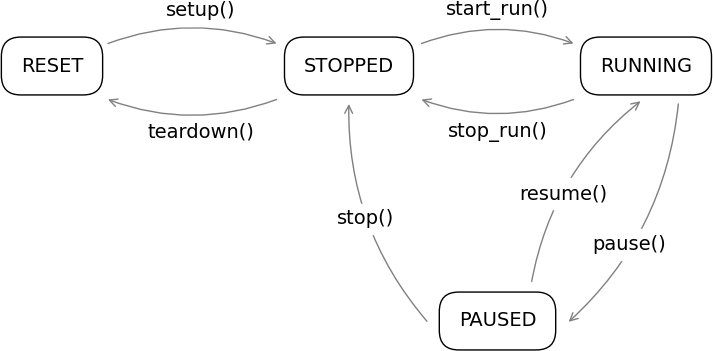

.. _runctrl:

:mod:`baldaquin.runctrl` --- Run control
========================================

This module provides all the basic facilities to control the data acquisition at
an abstract level.

The finite-state machine
------------------------

The :class:`FiniteStateMachine <baldaquin.runctrl.FiniteStateMachine>` class
represents a basic finite-state machine (FSM) with four states, defined in
the :class:`FsmState <baldaquin.runctrl.FsmState>` enum class
(``RESET``, ``STOPPED``, ``RUNNING`` and ``PAUSED``).
This is an abstract class, and subclasses are ultimately responsible for
reimplementing all the virtual methods, i.e.,

* :meth:`setup() <baldaquin.runctrl.FiniteStateMachine.setup()>`,
  called in the ``RESET`` -> ``STOPPED`` transition;
* :meth:`teardown() <baldaquin.runctrl.FiniteStateMachine.teardown()>`,
  called in the ``STOPPED`` -> ``RESET`` transition;
* :meth:`start_run() <baldaquin.runctrl.FiniteStateMachine.start_run()>`,
  called in the ``STOPPED`` -> ``RUNNING`` transition;
* :meth:`stop_run() <baldaquin.runctrl.FiniteStateMachine.stop_run()>`,
  called in the ``RUNNING`` -> ``STOPPED`` transition;
* :meth:`pause() <baldaquin.runctrl.FiniteStateMachine.pause()>`,
  called in the ``RUNNING`` -> ``PAUSED`` transition;
* :meth:`resume() <baldaquin.runctrl.FiniteStateMachine.resume()>`,
  called in the ``PAUSED`` -> ``RUNNING`` transition;
* :meth:`stop() <baldaquin.runctrl.FiniteStateMachine.stop()>`,
  called in the ``PAUSED`` -> ``STOPPED`` transition.

These virtual methods are actually never called directly, and all the interactions
with concrete instances of subclasses typically happen through four methods, mapping
to the typical buttons of a transport bar, that call the proper hook to set the FSM
in a given state, depending on the current state:

* :meth:`set_reset() <baldaquin.runctrl.FiniteStateMachine.set_reset()>`;
* :meth:`set_stopped() <baldaquin.runctrl.FiniteStateMachine.set_stopped()>`;
* :meth:`set_running() <baldaquin.runctrl.FiniteStateMachine.set_running()>`;
* :meth:`set_paused() <baldaquin.runctrl.FiniteStateMachine.set_paused()>`.

This assume that the target state can be reached via a valid transition from the
current state, and if that is not the case, an
:class:`InvalidFsmTransitionError <baldaquin.runctrl.InvalidFsmTransitionError>`
error is raised.

The finite-state machine emits a ``state_changed()`` signal whenever the underlying
state changes, signaling the state `after` the transition.

The run control
---------------

Module documentation
--------------------

.. automodule:: baldaquin.runctrl
